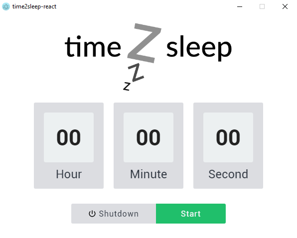

# time2sleep-react

<h3 align="center">A cross-platform shutdown timer</h3>
<p align="center"></p>

<a href="https://snyk.io//test/github/martinpham97/time2sleep-react?targetFile=package.json"></a>

## Compatibility

| Command/OS  | Windows			       | MacOS			        | Linux			         |
| ----------- | ------------------ | ------------------ | ------------------ |
| Shutdown    | :heavy_check_mark: | :heavy_check_mark: | :heavy_check_mark: |
| Reboot      | :heavy_check_mark: | :heavy_check_mark: | :heavy_check_mark: |
| Hibernate*	| :heavy_check_mark: | :x:				        | :x: 				       |
| Log-off 	  | :heavy_check_mark: | :x: 				        | :x: 				       |
| Sleep       | :x:      		       | :heavy_check_mark: | :x: 				       |

<p>* Hibernate command will be triggered instead of Sleep for Windows 8/10 if Hibernate is turned off</p>

## Releases/Download
Check out the releases [here](https://github.com/martinpham97/time2sleep-react/releases)

## Requirements
* [Node.js](https://nodejs.org)
* [Yarn](https://yarnpkg.com) (optional)

## Install
``` bash
# Clone the repository
$ git clone https://github.com/martinpham97/time2sleep-react

# Go into the repository
$ cd time2sleep-react

# Install dependencies
$ npm install
```

## Run
``` bash
$ npm start
```

## Build
``` bash
# Windows
$ npm run dist-win

# MacOS
$ npm run dist-mac

# Linux
$ npm run dist-linux
```

## License
[](https://app.fossa.io/projects/git%2Bgithub.com%2Fmartinpham97%2Ftime2sleep-react?ref=badge_large)

## Changelog
### 2.0.0 (04/10/2018)
* Updated react to version 16.5.2
* Updated babel to version 8
* Used javascript's ES2017 padStart() instead of util function for countdown input
* Added version number in window title
* Added environment variables
* Removed lru-cache
* Minor code refractor

### 1.0.1 (14/07/2018)
* Added lru-cache for better startup time
* Changed OS info events for better component load time
* Changed to solid background instead of transparent
* Added App ID for electron-builder
* Removed Squirrel for Windows builds
